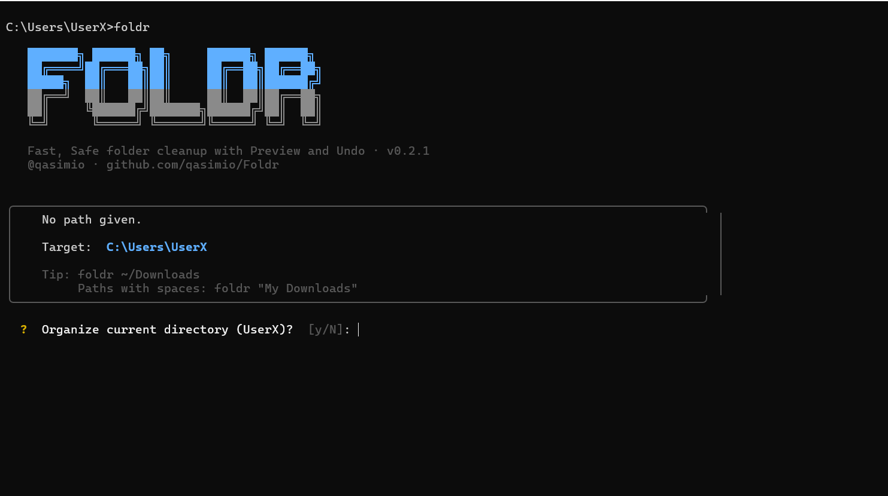

<div align="center">

# FOLDR

[](https://pypi.org/project/foldr/)
[](https://pepy.tech/projects/foldr)
[](https://docs.qasimio.me/docs/foldr/start-here)
[](#)
[](https://deepwiki.com/qasimio/Foldr)
[](LICENSE)


**You will never Oganize your files manually.**

<p align="center">
  
**7,000+ installs • 57 GitHub stars • Used daily by students & developers**

</p>

FOLDR is a cross-platform file automation CLI that organizes messy directories in seconds.

Preview every action before anything moves. Undo any operation instantly. Keep folders clean automatically with background watch mode.

Built for developers, students, creators, and anyone tired of organizing files by hand.

**📖 Documentation**
https://docs.qasimio.me/docs/foldr/start-here

</div>

---

<h2 align="center">Preview</h2>

<p align="center">
  
</p>

---

## Installation

```bash
pip install foldr
```

Requires Python 3.10+. Works on **Windows**, **Linux**, **macOS**

---


## Why FOLDR?

Every Downloads folder eventually turns a junk drawer.

Duplicates. Screenshots. PDFs. ZIP files. Random installers.

Most file organizers either move everything blindly or force you into complicated rules.

FOLDR takes a different approach.

- Preview every operation before anything changes.
- Undo any organize operation.
- Never overwrite existing files.
- Watch folders continuously in the background.
- Keep your filesystem predictable.

Automation should save time, not create anxiety.

---


## Quick Start

```bash
# Preview what would happen (nothing moves)
foldr ~/Downloads --preview

# Organize (shows preview, asks to confirm)
foldr ~/Downloads

# Undo the last operation
foldr undo

# Watch a folder — organize now and keep watching
foldr watch ~/Downloads
```

> **Paths with spaces** must be quoted:
> ```bash
> foldr "D:\My Downloads" --preview
> ```
```
Done?

Continue with the complete documentation:
https://docs.qasimio.me/docs/foldr/start-here
```

---

## Documentation

Looking for detailed guides, advanced usage, and examples?

📖 https://docs.qasimio.me/docs/foldr/start-here

---

## Why you can trust FOLDR

- **Preview by default** — FOLDR shows you what it will do and asks before moving anything.
- **Folders are never touched** — only files are moved; directories stay where they are.
- **Conflict-safe** — if a file with the same name already exists at the destination, FOLDR renames the incoming file (`photo_(1).jpg`, etc.) rather than overwriting.
- **Undo anything** — every operation is reversible via `foldr undo`.
- **Dedup is the only irreversible action** — always use `--preview` before `--dedup`.


If you've found a security vulnerability, please don't open a public issue.

Report it privately at:
**security@qasimio.me**

---

## 💖 Support

If FOLDR has become part of your daily workflow, supporting the project helps fund new features, bug fixes, and long-term maintenance.
Every contribution keeps FOLDR independent and actively developed.

[](https://patreon.com/qasimio)

---

## Author

**Built by Qasim Sethar**
[qasimio.me](https://qasimio.me)
[Github](https://github.com/qasimio)
<br>
LinkedIn: [linkedin.com/in/qasimio](https://www.linkedin.com/in/qasimio/)

---

## License

[MIT](LICENSE)

---

## Star History

<a href="https://www.star-history.com/?repos=qasimio%2FFOLDR&type=date&legend=top-left">
 <picture>
   <source media="(prefers-color-scheme: dark)" srcset="https://api.star-history.com/chart?repos=qasimio/FOLDR&type=date&theme=dark&legend=top-left&sealed_token=nRvWhSFeLGr0geFLPrNTsGQ4Z-SGfTeO5_g56Vm1QCMzt33eD8o-BTaTJU12u3HJSN-7Rr-7mPjy5dCL0n5zCDaLw2BxUjcU_oIjtUO8M1fKPiKWD4BsvA" />
   <source media="(prefers-color-scheme: light)" srcset="https://api.star-history.com/chart?repos=qasimio/FOLDR&type=date&legend=top-left&sealed_token=nRvWhSFeLGr0geFLPrNTsGQ4Z-SGfTeO5_g56Vm1QCMzt33eD8o-BTaTJU12u3HJSN-7Rr-7mPjy5dCL0n5zCDaLw2BxUjcU_oIjtUO8M1fKPiKWD4BsvA" />
   
 </picture>
</a>
